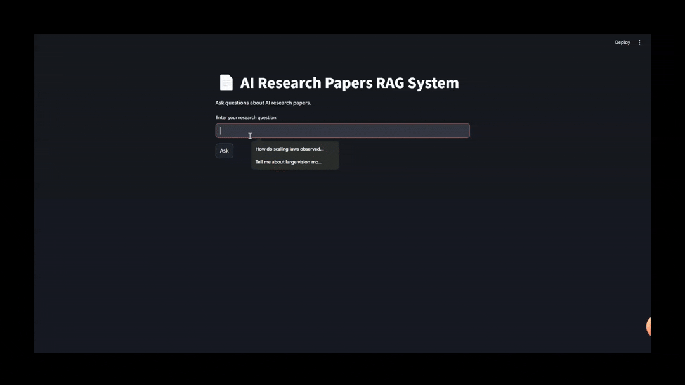

# AI-research-rag

## RAG-powered question answering system over AI research papers with topic search and paper summarization.

- **Generation:** [Ollama Llama 3.2 (3B)](https://ollama.ai/library/llama3.2)  
- **Embeddings:** [nomic-embed-text](https://huggingface.co/nomic-ai/nomic-embed-text-v1)  
- **Backend:** FastAPI (serves the RAG graph)  
- **Frontend:** Streamlit (chat-style UI)  
- **Database:** pgvector (PostgreSQL extension for vector storage)

----------------------------------------------------------------------
- ## Features
- Query classification (topic search / summarization / out-of-context)
- Semantic search over abstracts and full-text papers
- Summarization and explanation of research papers
- **Chunking strategy** for full papers to improve retrieval quality
- Simple UI for asking questions (Streamlit)
- Dockerized pgvector database
- Uses **Ollama Llama 3.2 (3B)** for text generation  
- Uses **nomic-embed-text** embeddings with LangChain for semantic search  
----------------------------------------------------------------------
- ## Evaluation
- ### Query Classification
  The **query classifier** is implemented as a **few-shot prompt-based LLM classifier**.
  It takes a user query and classifies it into one of three categories:
  `topic_search` → exploring research areas or asking for related papers.  
  `summarization_explanation` → asking to summarize or explain a specific paper/topic.  
  `out_of_scope` → queries unrelated to AI research papers.
  We evaluated on **60 queries** (20 per class).  

  | Class                     | Precision | Recall | F1-score |
  |----------------------------|-----------|--------|----------|
  | out_of_scope              | **1.000** | **1.000** | **1.000** |
  | summarization_explanation | **1.000** | 0.900  | 0.947    |
  | topic_search              | 0.909     | **1.000** | 0.952    |
  | **Accuracy**               |          |           |0.967      |

- ### Retrieval Evaluation Results

  We evaluate retrieval performance on the LitSearch dataset using **Precision@10** and **Recall@10**. (Princeton NLP, [LitSearch Paper](https://huggingface.co/datasets/princeton-nlp/LitSearch)) 
  
  Since exact string matching between retrieved and ground truth documents is not sufficient,  
  we use a lightweight LLM to judge whether each retrieved document is relevant to the query and the ground truth.  
  The metrics are then computed based on these LLM relevance judgments.

  | Metric        | Score  |
  |---------------|--------|
  | Precision@10  | 0.3886 |
  | Recall@10     | 0.9991 |

  ### How to Reproduce the Results
  #### 1. Download the dataset
Clone the Hugging Face dataset repo (it contains the `.parquet` files):
```bash
git clone https://huggingface.co/datasets/princeton-nlp/LitSearch
```
  Run evaluation
  ```bash
   python -m  evaluations.eval_retrival [query_dir] [corpus_clean_dir] [k]
  ```
  -⚠️ Work in progress. Test datasets and evaluation scripts will be added gradually.
----------------------------------------------------------------------
- ## System Diagram

----------------------------------------------------------------------
## 🛠 Setup
### 0. Install Ollama
This project uses [Ollama](https://ollama.ai/) to run **Llama 3.2 (3B)** and **nomic-embed-text** locally.  

- Download and install Ollama: [https://ollama.ai/download](https://ollama.ai/download)  
- Pull the required model:
  ```
  ollama pull llama3.2:3b
  ollama pull nomic-embed-text
  ```
### 1. Clone the repo
```
git clone https://github.com/kmalawany/AI-research-rag.git
cd ai-research-rag
```
### 2. Create .env file
#### Create a .env file in the project root with the following variables:
```
CONNECTION_NAME=your_connection_string_here (CONNECTION_NAME → Your pgvector/Postgres connection string)
ABSTRACT_COLLECTION=abstracts
PAPERS_COLLECTION=papers
```

### 3. Install dependencies
```
pip install -r requirements.txt
```
### 4. Download Arxiv dataset
https://www.kaggle.com/datasets/Cornell-University/arxiv

### 5. Generate and store embeddings
```
python create_vector_database.py [File path]
```
### 6. Start the FastAPI backend
```
uvicorn main:app --reload
```
### 7. Start the Streamlit UI
```
streamlit run app.py
```


