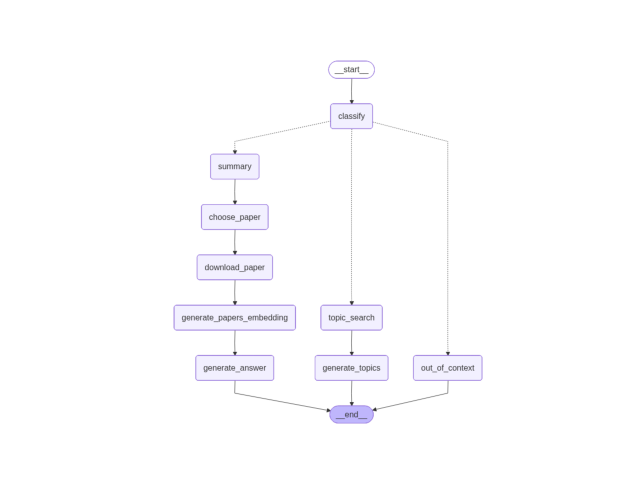

# AI-research-rag
RAG-powered question answering system over AI research papers with topic search and paper summarization.

- **Generation:** [Ollama Llama 3.2 (3B)](https://ollama.ai/library/llama3.2)  
- **Embeddings:** [nomic-embed-text](https://huggingface.co/nomic-ai/nomic-embed-text-v1)  
- **Backend:** FastAPI (serves the RAG graph)  
- **Frontend:** Streamlit (chat-style UI)  
- **Database:** pgvector (PostgreSQL extension for vector storage)

----------------------------------------------------------------------
- ## Features
- Query classification (topic search / summarization / out-of-context)
- Semantic search over abstracts and full-text papers
- Summarization and explanation of research papers
- **Chunking strategy** for full papers to improve retrieval quality
- Simple UI for asking questions (Streamlit)
- Dockerized pgvector database
- Uses **Ollama Llama 3.2 (3B)** for text generation  
- Uses **nomic-embed-text** embeddings with LangChain for semantic search  
----------------------------------------------------------------------
- ## System Diagram

----------------------------------------------------------------------
## 🛠 Setup
### 0. Install Ollama
This project uses [Ollama](https://ollama.ai/) to run **Llama 3.2 (3B)** and **nomic-embed-text** locally.  

- Download and install Ollama: [https://ollama.ai/download](https://ollama.ai/download)  
- Pull the required model:
  ```
  ollama pull llama3.2:3b
  ollama pull nomic-embed-text
  ```
### 1. Clone the repo
```
git clone https://github.com/kmalawany/AI-research-rag.git
cd ai-research-rag
```
### 2. Create .env file
#### Create a .env file in the project root with the following variables:
```
CONNECTION_NAME=your_connection_string_here (CONNECTION_NAME → Your pgvector/Postgres connection string)
ABSTRACT_COLLECTION=abstracts
PAPERS_COLLECTION=papers
```

### 3. Install dependencies
```
pip install -r requirements.txt
```
### 4. Download Arxiv dataset
https://www.kaggle.com/datasets/Cornell-University/arxiv

### 5. Generate and store embeddings
```
python create_vector_database.py [File path]
```
### 6. Start the FastAPI backend
```
uvicorn main:app --reload
```
### 7. Start the Streamlit UI
```
streamlit run app.py
```

#### Demo


